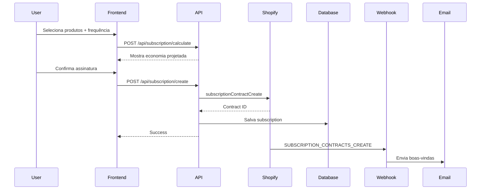
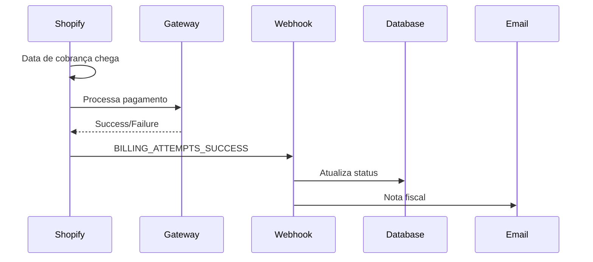
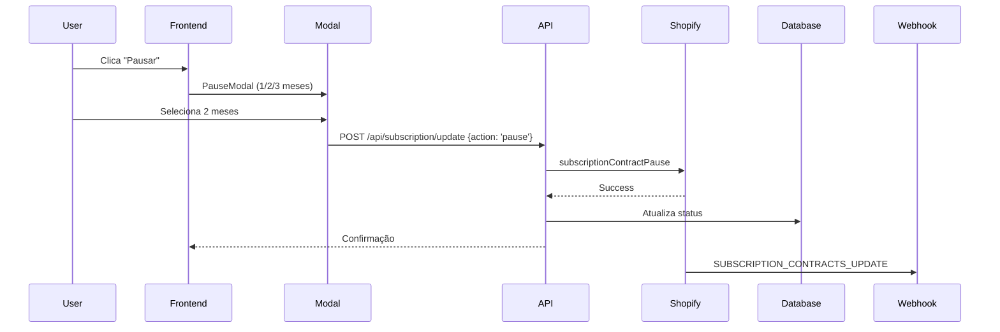

# Integração Shopify - Sistema de Assinaturas Terravik

## 📋 Índice

1. [Visão Geral](#visão-geral)
2. [Pré-requisitos](#pré-requisitos)
3. [Configuração Inicial](#configuração-inicial)
4. [Selling Plans (Planos de Venda)](#selling-plans)
5. [Subscription Contracts](#subscription-contracts)
6. [Webhooks](#webhooks)
7. [API Routes](#api-routes)
8. [Fluxo Completo](#fluxo-completo)
9. [Testes](#testes)
10. [Troubleshooting](#troubleshooting)

---

## 🎯 Visão Geral

O sistema de assinaturas da Terravik utiliza a **Shopify Subscription API (GraphQL)** e **Selling Plans** para oferecer:

- ✅ Entregas automáticas recorrentes
- ✅ Descontos progressivos (10-18%)
- ✅ Frete grátis em todas as entregas
- ✅ Gestão completa pelo assinante (pause, cancel, modify)
- ✅ Cobranças automáticas
- ✅ Webhooks para sincronização

**Frequências disponíveis:**
- 30 dias (10% desconto)
- 45 dias (12% desconto) - **Recomendado**
- 60 dias (15% desconto)
- 90 dias (18% desconto)

---

## 🔧 Pré-requisitos

### 1. Loja Shopify
- ✅ Plano **Shopify Plus** ou superior (necessário para Subscriptions API)
- ✅ App "Subscriptions" instalado no admin

### 2. Acesso à API
- ✅ App privado criado com permissões:
  - `read_products`
  - `write_products`
  - `read_orders`
  - `write_orders`
  - `read_customers`
  - `write_customers`
  - `read_subscriptions`
  - `write_subscriptions`

### 3. Variáveis de Ambiente

Adicione ao `.env.local`:

```bash
# Shopify API
NEXT_PUBLIC_SHOPIFY_STORE_DOMAIN=terravik.myshopify.com
SHOPIFY_STOREFRONT_ACCESS_TOKEN=seu_token_storefront
SHOPIFY_ADMIN_ACCESS_TOKEN=seu_token_admin_graphql

# Webhooks
SHOPIFY_WEBHOOK_SECRET=seu_webhook_secret

# URLs
NEXT_PUBLIC_SITE_URL=https://terravik.com.br
```

---

## ⚙️ Configuração Inicial

### 1. Criar Selling Plans no Shopify

Acesse **Settings > Apps and sales channels > Subscriptions** e crie os planos:

#### Plano 1: Assinatura 30 dias
```json
{
  "name": "Assinatura Terravik - A cada 30 dias",
  "options": ["A cada 30 dias"],
  "category": "SUBSCRIPTION",
  "billingPolicy": {
    "interval": "DAY",
    "intervalCount": 30
  },
  "deliveryPolicy": {
    "interval": "DAY",
    "intervalCount": 30
  },
  "pricingPolicies": [{
    "adjustmentType": "PERCENTAGE",
    "adjustmentValue": {
      "percentage": 10
    }
  }]
}
```

#### Plano 2: Assinatura 45 dias (Recomendado)
```json
{
  "name": "Assinatura Terravik - A cada 45 dias",
  "options": ["A cada 45 dias"],
  "category": "SUBSCRIPTION",
  "billingPolicy": {
    "interval": "DAY",
    "intervalCount": 45
  },
  "deliveryPolicy": {
    "interval": "DAY",
    "intervalCount": 45
  },
  "pricingPolicies": [{
    "adjustmentType": "PERCENTAGE",
    "adjustmentValue": {
      "percentage": 12
    }
  }]
}
```

#### Plano 3: Assinatura 60 dias
```json
{
  "name": "Assinatura Terravik - A cada 60 dias",
  "options": ["A cada 60 dias"],
  "category": "SUBSCRIPTION",
  "billingPolicy": {
    "interval": "DAY",
    "intervalCount": 60
  },
  "deliveryPolicy": {
    "interval": "DAY",
    "intervalCount": 60
  },
  "pricingPolicies": [{
    "adjustmentType": "PERCENTAGE",
    "adjustmentValue": {
      "percentage": 15
    }
  }]
}
```

#### Plano 4: Assinatura 90 dias
```json
{
  "name": "Assinatura Terravik - A cada 90 dias",
  "options": ["A cada 90 dias"],
  "category": "SUBSCRIPTION",
  "billingPolicy": {
    "interval": "DAY",
    "intervalCount": 90
  },
  "deliveryPolicy": {
    "interval": "DAY",
    "intervalCount": 90
  },
  "pricingPolicies": [{
    "adjustmentType": "PERCENTAGE",
    "adjustmentValue": {
      "percentage": 18
    }
  }]
}
```

### 2. Associar Produtos aos Selling Plans

Para cada produto (Nutrição Completa, Gramado Novo, Verde Rápido):

**GraphQL Mutation:**

```graphql
mutation productJoinSellingPlanGroups($id: ID!, $sellingPlanGroupIds: [ID!]!) {
  productJoinSellingPlanGroups(id: $id, sellingPlanGroupIds: $sellingPlanGroupIds) {
    product {
      id
    }
    userErrors {
      field
      message
    }
  }
}
```

**Variables:**
```json
{
  "id": "gid://shopify/Product/123456789",
  "sellingPlanGroupIds": [
    "gid://shopify/SellingPlanGroup/1",
    "gid://shopify/SellingPlanGroup/2",
    "gid://shopify/SellingPlanGroup/3",
    "gid://shopify/SellingPlanGroup/4"
  ]
}
```

---

## 📦 Selling Plans

### Buscar Selling Plans de um Produto

**Query GraphQL:**

```graphql
query getProductSellingPlans($id: ID!) {
  product(id: $id) {
    id
    title
    sellingPlanGroups(first: 10) {
      edges {
        node {
          id
          name
          sellingPlans(first: 10) {
            edges {
              node {
                id
                name
                options
                billingPolicy {
                  ... on SellingPlanRecurringBillingPolicy {
                    interval
                    intervalCount
                  }
                }
                pricingPolicies {
                  ... on SellingPlanFixedPricingPolicy {
                    adjustmentType
                    adjustmentValue {
                      ... on SellingPlanPricingPolicyPercentageValue {
                        percentage
                      }
                    }
                  }
                }
              }
            }
          }
        }
      }
    }
  }
}
```

### Mapear Frequência → Selling Plan ID

No código, crie um helper:

```typescript
// src/lib/shopify/selling-plans.ts

export const SELLING_PLAN_IDS = {
  30: 'gid://shopify/SellingPlan/ID_30_DIAS',
  45: 'gid://shopify/SellingPlan/ID_45_DIAS',
  60: 'gid://shopify/SellingPlan/ID_60_DIAS',
  90: 'gid://shopify/SellingPlan/ID_90_DIAS',
} as const;

export function getSellingPlanId(frequency: 30 | 45 | 60 | 90): string {
  return SELLING_PLAN_IDS[frequency];
}
```

---

## 🔄 Subscription Contracts

### Criar Subscription

**Mutation:**

```graphql
mutation subscriptionContractCreate($input: SubscriptionContractCreateInput!) {
  subscriptionContractCreate(input: $input) {
    contract {
      id
      status
      nextBillingDate
      customer {
        id
        email
      }
      lines(first: 10) {
        edges {
          node {
            id
            productId
            quantity
            currentPrice {
              amount
              currencyCode
            }
          }
        }
      }
    }
    userErrors {
      field
      message
    }
  }
}
```

**Input:**

```json
{
  "input": {
    "customerId": "gid://shopify/Customer/123456789",
    "currencyCode": "BRL",
    "nextBillingDate": "2026-02-05T00:00:00Z",
    "lines": [
      {
        "productVariantId": "gid://shopify/ProductVariant/123456789",
        "quantity": 2,
        "sellingPlanId": "gid://shopify/SellingPlan/ID_45_DIAS"
      }
    ],
    "deliveryMethod": {
      "shipping": {
        "address": {
          "address1": "Rua Exemplo, 123",
          "city": "São Paulo",
          "province": "SP",
          "zip": "01234-567",
          "countryCode": "BR"
        }
      }
    },
    "deliveryPrice": {
      "amount": "0.00",
      "currencyCode": "BRL"
    }
  }
}
```

### Atualizar Subscription

**Pausar:**

```graphql
mutation subscriptionContractPause($subscriptionContractId: ID!) {
  subscriptionContractPause(subscriptionContractId: $subscriptionContractId) {
    contract {
      id
      status
    }
    userErrors {
      field
      message
    }
  }
}
```

**Cancelar:**

```graphql
mutation subscriptionContractCancel($subscriptionContractId: ID!) {
  subscriptionContractCancel(subscriptionContractId: $subscriptionContractId) {
    contract {
      id
      status
    }
    userErrors {
      field
      message
    }
  }
}
```

**Atualizar Frequência:**

```graphql
mutation subscriptionContractUpdate($contractId: ID!, $input: SubscriptionContractUpdateInput!) {
  subscriptionContractUpdate(contractId: $contractId, input: $input) {
    contract {
      id
      nextBillingDate
    }
    userErrors {
      field
      message
    }
  }
}
```

---

## 🪝 Webhooks

### 1. Configurar Webhooks no Shopify

**Via GraphQL Admin API:**

```graphql
mutation webhookSubscriptionCreate($topic: WebhookSubscriptionTopic!, $webhookSubscription: WebhookSubscriptionInput!) {
  webhookSubscriptionCreate(topic: $topic, webhookSubscription: $webhookSubscription) {
    webhookSubscription {
      id
      topic
      endpoint {
        __typename
        ... on WebhookHttpEndpoint {
          callbackUrl
        }
      }
    }
    userErrors {
      field
      message
    }
  }
}
```

**Webhooks necessários:**

1. **SUBSCRIPTION_CONTRACTS_CREATE**
   ```json
   {
     "topic": "SUBSCRIPTION_CONTRACTS_CREATE",
     "webhookSubscription": {
       "callbackUrl": "https://terravik.com.br/api/subscription/webhook",
       "format": "JSON"
     }
   }
   ```

2. **SUBSCRIPTION_CONTRACTS_UPDATE**
3. **SUBSCRIPTION_BILLING_ATTEMPTS_SUCCESS**
4. **SUBSCRIPTION_BILLING_ATTEMPTS_FAILURE**
5. **SUBSCRIPTION_BILLING_ATTEMPTS_CHALLENGED**

### 2. Validação de Webhooks

A rota `/api/subscription/webhook/route.ts` já implementa:

- ✅ Validação de HMAC SHA256
- ✅ Verificação de headers obrigatórios
- ✅ Handlers específicos por evento
- ✅ Logging e error handling

**Importante:** Configure a variável `SHOPIFY_WEBHOOK_SECRET`:

```bash
SHOPIFY_WEBHOOK_SECRET=seu_secret_aqui
```

---

## 🛣️ API Routes

### Rotas Implementadas

#### 1. `POST /api/subscription/calculate`
Calcula preços e economia de uma assinatura.

**Request:**
```json
{
  "products": [
    { "basePrice": 89.90, "quantity": 2 }
  ],
  "frequency": 45
}
```

**Response:**
```json
{
  "success": true,
  "calculation": {
    "pricing": {
      "totalBasePrice": 179.80,
      "totalSubscriptionPrice": 158.22,
      "savingsPerDelivery": 21.58,
      "annualSavings": 173.44
    },
    "schedule": {
      "deliveriesPerYear": 8,
      "nextDeliveries": [...]
    }
  }
}
```

#### 2. `POST /api/subscription/create`
Cria nova assinatura (integrar com Shopify).

#### 3. `POST /api/subscription/update`
Atualiza assinatura existente (pause, cancel, etc).

#### 4. `POST /api/subscription/webhook`
Recebe webhooks do Shopify.

---

## 🔄 Fluxo Completo

### 1. Usuário Cria Assinatura



### 2. Cobrança Recorrente



### 3. Usuário Pausa Assinatura



---

## 🧪 Testes

### Testar Cálculos

```bash
curl -X POST http://localhost:3000/api/subscription/calculate \
  -H "Content-Type: application/json" \
  -d '{
    "products": [{"basePrice": 89.90, "quantity": 1}],
    "frequency": 45
  }'
```

### Testar Webhook (Mock)

```bash
curl -X POST http://localhost:3000/api/subscription/webhook \
  -H "Content-Type: application/json" \
  -H "X-Shopify-Topic: SUBSCRIPTION_CONTRACTS_CREATE" \
  -H "X-Shopify-Shop-Domain: terravik.myshopify.com" \
  -H "X-Shopify-Hmac-Sha256: fake_hmac_for_dev" \
  -d '{
    "admin_graphql_api_id": "gid://shopify/SubscriptionContract/123",
    "status": "active"
  }'
```

### Verificar Integração

1. ✅ Selling Plans criados no Shopify Admin
2. ✅ Produtos associados aos planos
3. ✅ Webhooks configurados e ativos
4. ✅ Variáveis de ambiente definidas
5. ✅ API Routes respondendo corretamente
6. ✅ Frontend mostrando opções de assinatura

---

## 🐛 Troubleshooting

### Erro: "Selling Plan not found"
- Verifique se o produto está associado ao Selling Plan Group
- Confirme os IDs em `SELLING_PLAN_IDS`

### Webhook não recebido
- Verifique URL pública acessível
- Confirme HMAC secret configurado
- Veja logs no Shopify Admin > Settings > Notifications > Webhooks

### Desconto não aplicado
- Verifique `pricingPolicies` do Selling Plan
- Confirme que o desconto está em %

### Cliente não pode assinar
- Plano Shopify deve ser Plus ou superior
- App "Subscriptions" deve estar instalado
- Cliente deve ter método de pagamento válido

---

## 📚 Recursos Adicionais

- [Shopify Subscription API Docs](https://shopify.dev/docs/apps/selling-strategies/subscriptions)
- [Selling Plans Guide](https://shopify.dev/docs/apps/selling-strategies/subscriptions/selling-plans)
- [Webhooks Reference](https://shopify.dev/docs/api/admin-rest/2024-01/resources/webhook)

---

## ✅ Checklist de Go-Live

- [ ] Selling Plans criados (30, 45, 60, 90 dias)
- [ ] Todos os produtos associados aos planos
- [ ] Webhooks configurados e testados
- [ ] Variáveis de ambiente em produção
- [ ] HMAC validation ativa
- [ ] Emails transacionais configurados
- [ ] Analytics configurado (conversões de assinatura)
- [ ] Testes end-to-end executados
- [ ] Política de cancelamento publicada
- [ ] Suporte treinado sobre assinaturas

---

**Última atualização:** 04/02/2026  
**Versão:** 1.0  
**Responsável:** Terravik Tech Team
